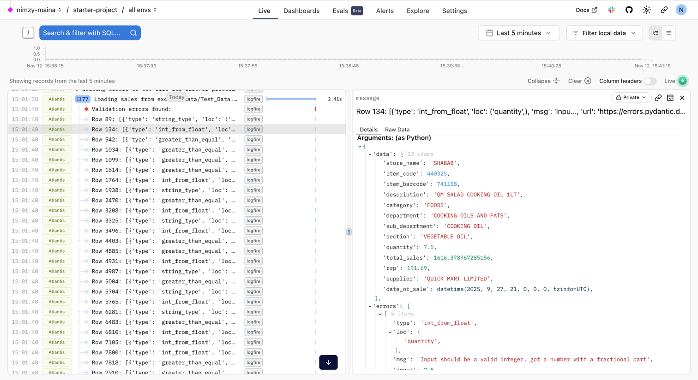

# Duck Ingestion

## Project Setup

## System Requirements

- You need python 3.9+
- uv (python package manager)

### Setup Logfire

Logfire is used for monitoring ingestion activity. 
You can view logs from the "live" dashboard.


This tool provides a centralized view the following from your pipelines and your APIs.
- Logs
- Metrics
- Alerts

Below is an example screenshot of validation checks done during the ingestion process.



You can also configure Dashboards to monitor the health of your infrastructure. 

Signup here to get an **API TOKEN** - [Logfire Sign Up](https://pydantic.dev/logfire) and set **LOGFIRE_API_TOKEN** in your **.env** file

```dotenv
LOGFIRE_API_TOKEN=pylf_v1_eu_...
```

### Setup project

Install dependencies from root directory
```terminal
$ uv sync 
```


## Running Excel Ingestion Pipeline

Running ingestion will use **pydantic**  to validate the data in the Excel dump. 
These validation rules can be customized according to business needs.
```terminal
$ uv run ingest.py 
```

Rows of data which don't pass the validation check are exported to the error directory.

In a production environment, you can log metrics to track a stores data accuracy, a simple percentage can be used.

# Data Architecture

I would go with the [**Medallion Architecture**](https://www.databricks.com/glossary/medallion-architecture) which allows data to flow through multiple layers, improving in **quality, structure,** and **usability** at each step.

For example, I would imagine that data from QuickMark & Carrefour have different formats so at their individual formats, that would fall under **Bronze** layer. 
The data can then be Augmented into a uniform schema at the **Silver** layer before finally "massaging" it into the **Gold** layer for business analytics. 